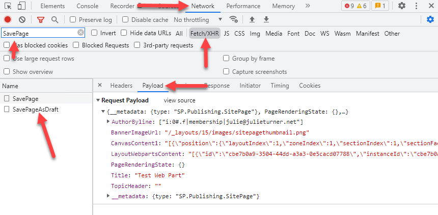

# Client-Side Pages

The client-side pages API included in this library is an implementation that was reverse engineered from the first-party API's and is unsupported by Microsoft. Given how flexible pages are we've done our best to give you the endpoints that will provide the functionality you need but that said, implementing these APIs is one of hte more complicated tasks you can do.

It's especially important to understand that the product team is constantly changing the features of pages and often that will also end up changing how the APIs that we've hijacked behave and because they are not offical third-party APIs this can cause our implementation to break.  In order to fix those breaks we need to go back to the beginning and re-validate how the endpoints work searching for what has changed and then implementing those changes in our code. This is by no means simple. If you are reporting an issue with the pages API be aware that it may take significant time for us to unearth what is happening and fix it. Any research that you can provide when sharing your issue will go a long way in expediating that process, or better yet, if you can track it down and submit a PR with a fix we would be most greatful.

## Tricks to help you figure out how to add first-party web parts to your page

This section is to offer you methods to be able to reverse engineer some of the first party web parts to help figure out how to add them to the page using the `addControl` method.

Your first step needs to be creating a test page that you can inspect.

1. Create a new Site Page.
1. Open the browser console, and navigate to the network tab
1. Filter the network tab for `Fetch/XHR` and then type `SavePage` to filter for the specific network calls.
1. Add and configure the web part you want to reverse engineer and then save the page as draft. The network tab will now show a `SavePageAsDraft` call and you can then look at the `Payload` of that call
    
1. You then want to specifically look at the `CanvasContent1` property and copy that value. You can then paste it into a temporary file with the .json extension in your code editor so you can inspect the payload. The value is an array of objects, and each object (except the last) is the definition of the web part.

Below is an example (as of the last change date of this document) of what the QuickLinks web part looks like. One key takeaway from this file is the `webPartId` property which can be used when filtering for the right web part definition after getting a collection from `sp.web.getClientsideWebParts();`.
>Note that it could change at any time so please do not rely on this data, please use it as an example only.

```JSON
{
    "position": {
        "layoutIndex": 1,
        "zoneIndex": 1,
        "sectionIndex": 1,
        "sectionFactor": 12,
        "controlIndex": 1
    },
    "controlType": 3,
    "id": "00000000-58fd-448c-9e40-6691ce30e3e4",
    "webPartId": "c70391ea-0b10-4ee9-b2b4-006d3fcad0cd",
    "addedFromPersistedData": true,
    "reservedHeight": 141,
    "reservedWidth": 909,
    "webPartData": {
        "id": "c70391ea-0b10-4ee9-b2b4-006d3fcad0cd",
        "instanceId": "00000000-58fd-448c-9e40-6691ce30e3e4",
        "title": "Quick links",
        "description": "Show a collection of links to content such as documents, images, videos, and more in a variety of layouts with options for icons, images, and audience targeting.",
        "audiences": [],
        "serverProcessedContent": {
            "htmlStrings": {},
            "searchablePlainTexts": {
                "items[0].title": "PnPjs Title"
            },
            "imageSources": {},
            "links": {
                "baseUrl": "https://contoso.sharepoint.com/sites/PnPJS",
                "items[0].sourceItem.url": "/sites/PnPJS/SitePages/pnpjsTestV2.aspx"
            },
            "componentDependencies": {
                "layoutComponentId": "706e33c8-af37-4e7b-9d22-6e5694d92a6f"
            }
        },
        "dataVersion": "2.2",
        "properties": {
            "items": [
                {
                    "sourceItem": {
                        "guids": {
                            "siteId": "00000000-4657-40d2-843d-3d6c72e647ff",
                            "webId": "00000000-e714-4de6-88db-b0ac40d17850",
                            "listId": "{00000000-8ED8-4E43-82BD-56794D9AB290}",
                            "uniqueId": "00000000-6779-4979-adad-c120a39fe311"
                        },
                        "itemType": 0,
                        "fileExtension": ".ASPX",
                        "progId": null
                    },
                    "thumbnailType": 2,
                    "id": 1,
                    "description": "",
                    "fabricReactIcon": {
                        "iconName": "heartfill"
                    },
                    "altText": "",
                    "rawPreviewImageMinCanvasWidth": 32767
                }
            ],
            "isMigrated": true,
            "layoutId": "CompactCard",
            "shouldShowThumbnail": true,
            "imageWidth": 100,
            "buttonLayoutOptions": {
                "showDescription": false,
                "buttonTreatment": 2,
                "iconPositionType": 2,
                "textAlignmentVertical": 2,
                "textAlignmentHorizontal": 2,
                "linesOfText": 2
            },
            "listLayoutOptions": {
                "showDescription": false,
                "showIcon": true
            },
            "waffleLayoutOptions": {
                "iconSize": 1,
                "onlyShowThumbnail": false
            },
            "hideWebPartWhenEmpty": true,
            "dataProviderId": "QuickLinks",
            "webId": "00000000-e714-4de6-88db-b0ac40d17850",
            "siteId": "00000000-4657-40d2-843d-3d6c72e647ff"
        }
    }
}
```

At this point the only aspect of the above JSON payload you're going to be paying attention to is the `webPartData`. We have exposed `title`, `description`, and `dataVersion` as default properties of the `ClientsideWebpart` class. In addition we provide a `getProperties`, `setProperties`, `getServerProcessedContent`, `setServerProcessedContent` methods. The difference in this case in these set base methods is that it will merge the object you pass into those methods with the values already on the object.

The code below gives a incomplete but demonstrative example of how you would extend the ClientsideWebpart class to provide an interface to build a custom class for the QuickLinks web part illustrated in our JSON payload above. This code assumes you have already added the control to a section. For more information about that step see the documentation for [Add Controls](../sp/clientside-pages.md#Add_Controls)

```TypeScript
import { sp } from "@pnp/sp";
import "@pnp/sp/webs";
import { ClientsideWebpart } from "@pnp/sp/clientside-pages";

//Define interface based on JSON object above
interface IQLItem {
    sourceItem: {
        guids: {
            siteId: string;
            webId:  string;
            listId:  string;
            uniqueId:  string;
        },
        itemType: number;
        fileExtension: string;
        progId: string;
    }
    thumbnailType: number;
    id: number;
    description: string;
    fabricReactIcon: { iconName: string; };
    altText: string;
    rawPreviewImageMinCanvasWidth: number;
}

// we create a class to wrap our functionality in a reusable way
class QucikLinksWebpart extends ClientsideWebpart {

  constructor(control: ClientsideWebpart) {
    super((<any>control).json);
  }

  // add property getter/setter for what we need, in this case items array within properties
  public get items(): IQLItem[] {
    return this.json.webPartData?.properties?.items || [];
  }

  public set items(value: IQLItem[]) {
    this.json.webPartData.properties?.items = value;
  }
}

// now we load our page
const page = await sp.web.loadClientsidePage("/sites/PnPJS/SitePages/QuickLinks-Web-Part-Test.aspx");

// get our part and pass it to the constructor of our wrapper class.
const part = new QucikLinksWebpart(page.sections[0].columns[0].getControl(0));

//Need to set all the properties
part.items = [{IQLItem_properties}];

await page.save();
```
